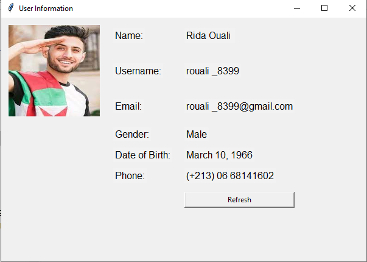
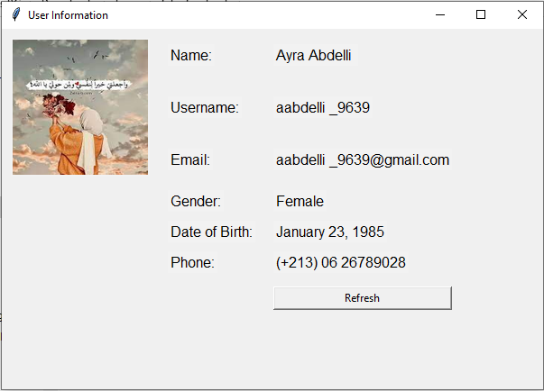
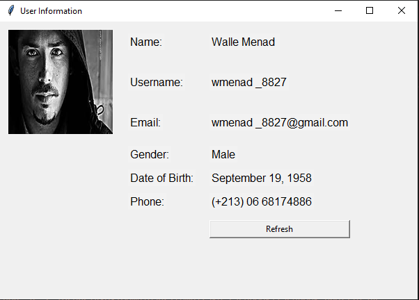
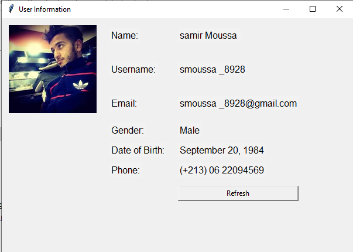

# Algerian-Person-Generator

## Description

The Algerian Fake Social Media Account Generator is a Python application built using the Tkinter GUI library. It generates random Algerian user information, including names, usernames, emails, gender, date of birth, and phone numbers. The application also displays random images of Algerian individuals. The primary purpose of this application is to create fictional Algerian social media profiles for various purposes, including testing, demonstration, or educational use.

 
  


## Installation

To run this application on your local machine, follow these steps:

1. Clone the repository:

   ```bash
   git clone https://github.com/yourusername/algerian-person-generator.git
   cd algerian-person-generator


2. install pillow :
    ```bash
    pip install pillow
    
3. Run the application:
   ```bash
   python facebook_profile.py

